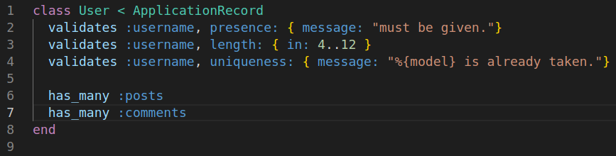
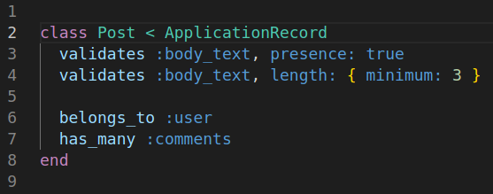

# Micro Reddit

This project was created to practice active record and model associations. There is no HTML or CSS for this project.

### Models

  <figure>
    <figcaption>User Model</figcaption>
    
  </figure>
  <figure>
    <figcaption>Post Model</figcaption>
    
  </figure>
  <figure>
    <figcaption>Comment Model</figcaption>
    
  </figure>

### Using the Associations

* User.posts
* User.comments
* Post.user
* Post.comments
* Comment.post
* Comment.user
